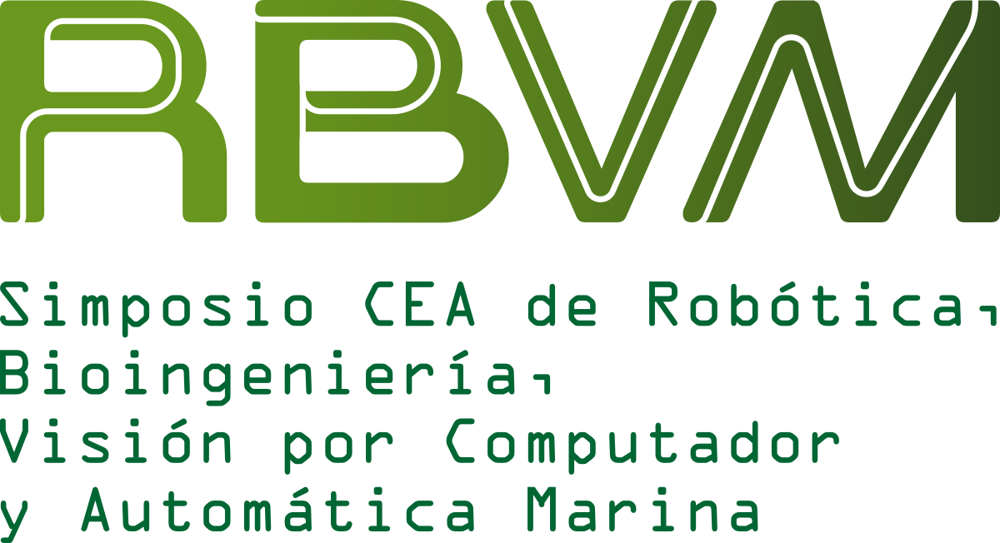
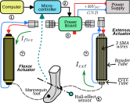
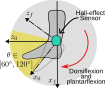
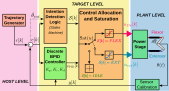
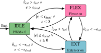
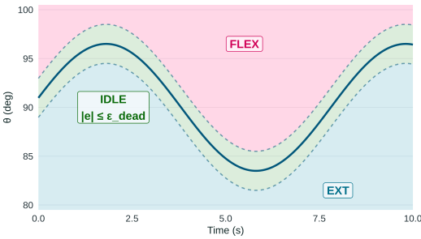
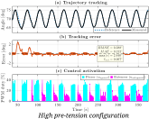
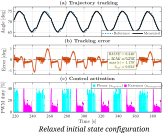
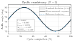
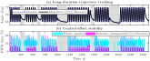

---
format:
  roboticslab-slides-revealjs: default
---

```{r setup, include=FALSE}
options(width = 80)
knitr::opts_chunk$set(
  echo = FALSE,
  warning = FALSE,
  message = FALSE,
  fig.align = "center",
  out.width = "100%",
  fig.format = "svg"
)
```

## Cover {.rl-cover .rl-cover-dark .rl-logos-compact footer=false}

::: {.rl-cover-top}
::: {.rl-event}
Simposio CEA de Robótica, Bioingeniería, Visión por Computador y Automática Marina 2026 · Bilbao · 10–12 June 2026
:::

::: {.rl-cover-logos}
{.rl-logo}
{.rl-logo}
{.rl-logo}
{.rl-logo .rl-logo-wide}
:::

:::

::: {.rl-cover-main}

::: {.rl-kicker}
Oral presentation
:::

::: {.rl-paper-title}
Indirect Thermal-Aware Supervision for Agonist–Antagonist SMA Ankle Actuation
:::

::: {.rl-authors}
Sergio Jácobo-Zavaleta · Dorin Copaci · Sofía Die-Pancorbo · Dolores Blanco · Luis Moreno
:::

::: {.rl-affiliation}
Department of Systems Engineering and Automation · Universidad Carlos III de Madrid
:::
:::

::: {.rl-cover-bottom}
SRAR Project · Soft Robotics for Ankle Rehabilitation · RoboticsLab
:::

## Motivation and control challenge {.rl-bg-light .rl-compact}

### Compact actuation is attractive, but heat recovery limits endurance

:::: {.columns}

::: {.column width="52%"}

::: {.rl-info-panel .rl-info-compact .rl-info-card-wide}

::: {.rl-info-card .rl-info-petrol}
**Why SMA?**  
[Lightweight]{.rl-text-cyan .rl-bold}, [silent]{.rl-text-teal .rl-bold} and compact actuation for early-stage ankle mobilization.
:::

::: {.rl-info-card .rl-info-rose}
**Main limitation**  
Heating is fast, but [cooling is slow]{.rl-mark-pink}; repeated activation can produce [heat accumulation]{.rl-text-rose .rl-bold}.
:::

::: {.rl-info-card .rl-info-gold}
**Control challenge**  
Preserve [closed-loop tracking]{.rl-text-teal .rl-bold} while reducing [unnecessary Joule heating]{.rl-text-rose .rl-bold}.
:::

:::

:::

::: {.column width="48%"}

:::{.fragment}
::: {.rl-result-card}

::: {.rl-sticker .rl-sticker-yellow style="top: 0.6em; left: 8%; transform: rotate(-3deg);"}
Core idea
:::

::: {.rl-info-panel .rl-info-large style="--rl-info-card-width: 94%;"}

::: {.rl-info-card .rl-info-green}
Do not only ask:

**“How much should I track?”**

Also ask:

**[When should energy enter the actuator?]{.rl-mark-yellow}**
:::

:::

:::
:::

:::{.fragment}
::: {.rl-observation-chips}
<span class="rl-chip rl-chip-cyan">Agonist–antagonist SMA</span>
<span class="rl-chip rl-chip-green">Free cooling</span>
<span class="rl-chip rl-chip-rose">Thermal-aware supervision</span>
<span class="rl-chip rl-chip-yellow">BPID tracking</span>
:::
:::

:::

::::

::: {.rl-slide-note .rl-note-short}
The goal is not only accurate motion, but [sustained tracking]{.rl-mark-yellow} through control decisions that reduce unnecessary heating.
:::

## SYSTEM {.rl-big-title .rl-bg-dark .rl-word-gold}
### Antagonistic SMA ankle module

## Actuation architecture {.rl-bg-pearl .rl-compact}

:::: {.columns}

::: {.column width="70%"}

:::

::: {.column width="30%"}
:::{.fragment}

::: {.rl-info-panel .rl-info-compact .rl-info-card-wide}

:::{.incremental}
1. Host computer
2. STM32F4 target
3. Power electronics
4. Physical plant
5. Position sensor
:::

:::


:::

<!-- 1. Host computer: trajectory generation, GUI and data logging.
2. STM32F4 target: state supervision, BPID control and PWM generation.
3. Power electronics: Mosfet drivers and current sensing.
4. Physical plant: antagonistic SMA actuator and ankle surrogate.
5. Position sensors: ankle angle. -->

:::{.fragment}

:::

:::

::::


## CONTROL {.rl-big-title .rl-bg-navy .rl-word-aqua}

### Tracking + thermal-aware supervision

## Closed-loop control scheme {.rl-bg-teal .rl-compact}

:::: {.columns}

::: {.column width="65%"}

:::

::: {.column width="35%"}

:::{.fragment}
The control scheme consists of:

::: {.incremental}
::: {.rl-info-panel .rl-info-compact .rl-info-card-wide}

::: {.rl-info-card .rl-info-rose}
**Supervisory decision layer**  
Determines when each SMA group is allowed to receive Joule heating.
:::

::: {.rl-info-card .rl-info-green}
**Bilinear PID layer**  
Computes how much control effort is applied to the active group.
:::

:::
:::

:::

:::

::::

::: {.rl-slide-note .rl-note-compact}
The [supervisor]{.rl-text-red .rl-bold} decides [when to heat]{.rl-mark-yellow}; the [BPID]{.rl-text-green .rl-bold} decides [how much]{.rl-text-green .rl-bold}.
:::


## State logic {.rl-bg-teal}

### State machine (motion intention and tracking error)

:::: {.columns}

::: {.column width="50%"}

:::

::: {.column width="50%"}
::: {.fragment}

:::

:::


::::

::: {.rl-slide-note .rl-note-compact}
[Inside the band]{.rl-mark-yellow}, the system stays in [IDLE]{.rl-text-teal .rl-bold} and exploits [free cooling]{.rl-text-green .rl-bold}.
<!-- [Inside the band]{.rl-mark-yellow}, the supervisor remains in [IDLE]{.rl-text-teal .rl-bold} to enable [free cooling]{.rl-text-green .rl-bold}; outside the band, it switches to [FLEX]{.rl-text-rose .rl-bold} or [EXT]{.rl-text-cyan .rl-bold}. -->
<!-- The supervisor acts on [bands around the reference]{.rl-mark-yellow}: inside the band it stays in [IDLE]{.rl-text-teal .rl-bold} for [free cooling]{.rl-text-green .rl-bold}, while outside the band it switches to [FLEX]{.rl-text-rose .rl-bold} or [EXT]{.rl-text-cyan .rl-bold}. -->
<!-- The supervisor acts on [bands around the reference]{.rl-mark-yellow}: [IDLE]{.rl-text-teal .rl-bold} inside the band, [FLEX]{.rl-text-rose .rl-bold} above it, and [EXT]{.rl-text-cyan .rl-bold} below it. -->
:::

## RESULTS {.rl-big-title .rl-bg-gold .rl-word-petrol}


## Results: configuration comparison {.rl-bg-pearl .rl-compact}

:::: {.columns}

::: {.column width="50%"}

::: {.rl-result-card}
{width="76%"}

::: {.rl-sticker .rl-sticker-yellow .rl-sticker-left}
Lower backlash
:::
:::

:::{.fragment}
::: {.rl-metric-row}
<span class="rl-metric">RMSE = [0.388°]{.rl-text-teal .rl-bold} ·</span>
<span class="rl-metric">MAE = [0.212°]{.rl-text-teal .rl-bold} ·</span>
<span class="rl-metric">max $|e|$ = [2.440°]{.rl-text-rose .rl-bold}</span>
:::
:::

:::

::: {.column width="50%"}

::: {.rl-result-card}
{width="76%"}

::: {.rl-sticker .rl-sticker-green .rl-sticker-right}
More passive compliance
:::
:::

:::{.fragment}
::: {.rl-metric-row}
<span class="rl-metric">RMSE = [0.346°]{.rl-text-teal .rl-bold} ·</span>
<span class="rl-metric">MAE = [0.259°]{.rl-text-teal .rl-bold} ·</span>
<span class="rl-metric">max $|e|$ = [1.170°]{.rl-text-green .rl-bold}</span>
:::
:::

:::

::::

::: {.rl-slide-note .rl-note-short}
[High pre-tension]{.rl-text-gold .rl-bold} improves early mechanical response, but the [relaxed state]{.rl-text-cyan .rl-bold} reduces peak error and promotes recurrent [free-cooling intervals]{.rl-text-green .rl-bold}.
<!-- High pre-tension improves early mechanical response, but relaxed state is better for thermal robustness. -->
:::

## Results: cyclic repeatability {.rl-bg-pearl .rl-compact}

### The response remains consistent from cycle to cycle

:::: {.columns}

::: {.column width="60%"}

::: {.rl-result-card}
{width="92%"}

::: {.rl-sticker .rl-sticker-cyan .rl-sticker-left}
Low dispersion
:::
:::

:::

::: {.column width="40%"}

::: {.rl-result-panel}

:::{.fragment}
::: {.rl-stat-card}
**Mean dispersion:**  $\bar{\sigma}$ = [0.068°]{.rl-text-teal .rl-bold}
:::
:::

:::{.fragment}
::: {.rl-stat-card}
**Maximum dispersion:** $\sigma_{max}$ = [0.202°]{.rl-text-cyan .rl-bold}
:::
:::

:::{.fragment}
::: {.rl-stat-card .rl-stat-gold}
**Peak mismatch:** $\Delta_{pk,max}$ = [0.637°]{.rl-text-gold .rl-bold}
:::
:::

:::{.fragment}
::: {.rl-stat-card .rl-stat-rose}
**Overall cyclic RMSE:** RMSE$_{all}$ = [0.169°]{.rl-text-rose .rl-bold}
:::
:::

:::{.fragment}
This indicates:

::: {.rl-observation-chips}
<span class="rl-chip rl-chip-green">High repeatability</span>
<span class="rl-chip rl-chip-cyan">Low inter-cycle drift</span>
<span class="rl-chip rl-chip-cyan">Stable closed-loop behavior</span>
:::

:::

:::


:::

::::

::: {.rl-slide-note .rl-note-short}
The [small dispersion band]{.rl-mark-yellow} shows that tracking is not only accurate, but [repeatable cycle after cycle]{.rl-text-teal .rl-bold}.
:::

## Results: long-duration endurance {.rl-bg-pearl .rl-compact}

### Stable operation over 40 minutes without thermal saturation

:::: {.columns}

::: {.column width="64%"}

::: {.rl-result-card}
{width="96%"}

::: {.rl-sticker .rl-sticker-yellow .rl-sticker-left}
40-minute endurance
:::

::: {.rl-sticker .rl-sticker-green style="bottom: -0.8em; right: 7%; transform: rotate(3deg);"}
No persistent saturation
:::
:::

:::{.fragment}
::: {.rl-observation-chips}
<span class="rl-chip rl-chip-yellow">Recovery intervals</span>
<span class="rl-chip rl-chip-green">No tracking collapse</span>
<span class="rl-chip rl-chip-cyan">Closed-loop recovery</span>
:::
:::

:::

::: {.column width="36%"}

::: {.rl-result-panel}

:::{.fragment}
::: {.rl-stat-card .rl-stat-gold}
**Duration**  
[40 min]{.rl-text-gold .rl-bold} closed-loop operation
:::
:::

:::{.fragment}
::: {.rl-stat-card}
**Tracking accuracy**  
RMSE$_{active}$ = [0.218°]{.rl-text-teal .rl-bold}
:::
:::

:::{.fragment}
::: {.rl-stat-card .rl-stat-rose}
**Worst-case error**  
max $|e|$ = [1.384°]{.rl-text-rose .rl-bold}
:::
:::

:::{.fragment}
::: {.rl-stat-card .rl-stat-green}
**Thermal behavior**  
Recovery intervals prevent persistent heat accumulation
:::
:::

:::

:::


::::

::: {.rl-slide-note .rl-note-short}
The key result is [sustained tracking]{.rl-mark-yellow}: recovery windows are embedded in the control strategy, preventing persistent heat accumulation while keeping the loop active.
:::

## Discussion and take-home message {.rl-split-30-70 .rl-light .rl-split-wide}

### What do these results mean?

::: {.rl-info-panel .rl-info-plain .rl-info-discussion-lg}
<!-- ::: {.rl-info-panel .rl-info-plain .rl-info-discussion-lg style="--rl-info-font-size: 0.88em; --rl-info-card-width: 88%;"} -->

:::{.fragment}
::: {.rl-info-card .rl-info-gold}
[Tracking accuracy alone is not enough]{.rl-mark-yellow}: in SMA systems, [thermal recovery]{.rl-text-rose .rl-bold} must be part of the control architecture.
:::
:::

:::{.fragment}
::: {.rl-info-card .rl-info-petrol}
The supervisor does not need direct temperature sensing. It uses [motion intention]{.rl-text-petrol .rl-bold} and [signed tracking error]{.rl-text-gold .rl-bold}.
:::
:::

:::{.fragment}
::: {.rl-info-card .rl-info-green}
[Inside the band]{.rl-mark-green}, the controller stays in [IDLE]{.rl-text-teal .rl-bold} and exploits [free cooling]{.rl-text-green .rl-bold}.
:::
:::

:::{.fragment}
::: {.rl-info-card .rl-info-rose}
**Take-home message**  
[Indirect thermal-aware supervision]{.rl-mark-cyan .rl-bold} enables SMA ankle actuation that is [repeatable, sustained, and thermally robust]{.rl-text-teal .rl-bold}.
:::
:::

:::


## Closing {.rl-cover .rl-cover-closing .rl-cover-dark .rl-logos-compact}

::: {.rl-cover-top}
::: {.rl-event}
Simposio CEA de Robótica, Bioingeniería, Visión por Computador y Automática Marina 2026 · Bilbao
:::

::: {.rl-cover-logos}
{.rl-logo}
{.rl-logo}
{.rl-logo}
{.rl-logo .rl-logo-wide}
:::
:::

::: {.rl-cover-main}
::: {.rl-closing-thanks}
Thank you
:::

::: {.rl-kicker}
Discussion
:::

::: {.rl-paper-title}
Questions?
:::

::: {.rl-authors}
Indirect Thermal-Aware Supervision for Agonist–Antagonist SMA Ankle Actuation
:::

::: {.rl-affiliation}
Sergio Jácobo-Zavaleta · Dorin Copaci · Sofía Die-Pancorbo · Dolores Blanco · Luis Moreno
:::
:::

::: {.rl-cover-bottom}
Universidad Carlos III de Madrid · SRAR Project · RoboticsLab
:::
